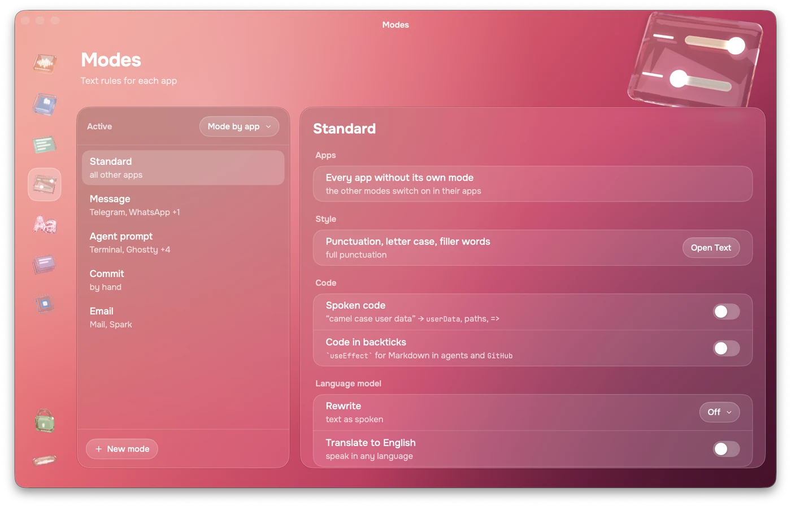
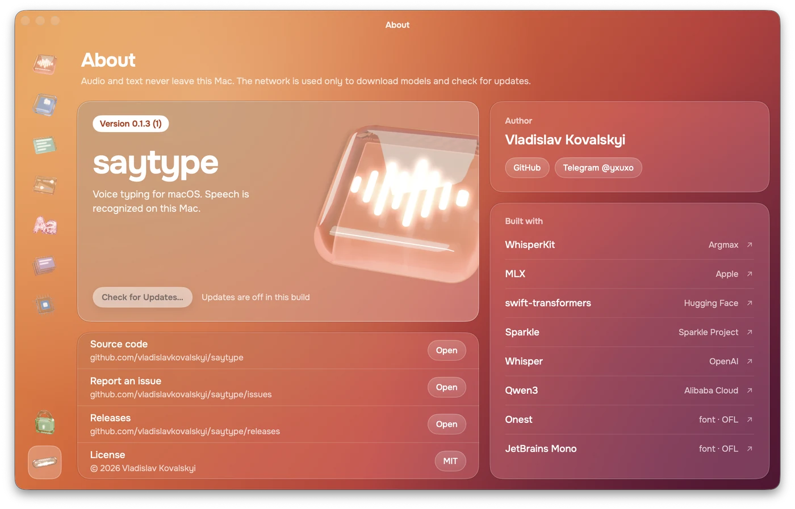

<p align="center">
  
</p>

<h1 align="center">saytype</h1>

<p align="center">
  Hold <kbd>fn</kbd>, talk, let go. Your words land in any app as clean, formatted text.<br>
  Whisper runs on your Mac. Nothing leaves it.
</p>

<p align="center">
  <a href="https://github.com/vladislavkovalskyi/saytype/releases/latest/download/saytype.dmg"></a>
</p>

<p align="center">
  macOS 26+ · Apple Silicon · Free and open source · <a href="README.ru.md">Читать по-русски</a>
</p>

<p align="center">
  
</p>

## Why saytype

- **You see the words while you speak.** Live text grows out of the notch as you talk, not after you stop.
- **Two languages in one sentence.** Say «поправь useEffect в Header» and get `useEffect` spelled like code, not transliterated.
- **Text arrives formatted.** Punctuation, paragraphs from pauses, numbered lists when you enumerate. A small local model adds structure to long dictations without touching your words.
- **Or the way you text.** Chat style writes in lowercase with commas only. Word filters drop the words you never want to see.
- **A mode for every app.** Chat style in Telegram, spoken code and backticks in Claude Code and Cursor, a commit message by hand.
- **Local AI rewrites.** Turn rambling into a clean agent prompt, a commit or English text with Qwen3 4B, Ollama or LM Studio.
- **650+ dev terms out of the box.** Claude Code, ChatGPT, Next.js, Supabase, Figma, LGTM and more, spelled right with no setup.
- **Offline and private.** Recognition and formatting run on the Neural Engine and GPU. The network is used only to download models.

Built for people who talk to coding agents all day: Claude Code, Cursor, Codex, terminals, browsers, chat.

<p align="center">
  
</p>

## Install

With Homebrew, the easiest way:

```sh
brew install --cask vladislavkovalskyi/tap/saytype
```

Or [download saytype.dmg](https://github.com/vladislavkovalskyi/saytype/releases/latest/download/saytype.dmg) and drag saytype to Applications.

> [!NOTE]
> saytype is free and isn't notarized by Apple, which costs $99 a year. After installing from the DMG, macOS may refuse the first launch: open **System Settings → Privacy & Security** and click **Open Anyway**, or run
> `xattr -dr com.apple.quarantine /Applications/saytype.app`. Homebrew does this for you.

## First launch

Setup takes eight short steps. Whisper downloads once (632 MB), then Core ML prepares it for your chip, about 2–3 minutes.

<table>
  <tr>
    <td width="50%"></td>
    <td width="50%"></td>
  </tr>
  <tr>
    <td><b>1 · Welcome.</b> What saytype does, in three lines.</td>
    <td><b>2 · Overlay.</b> Island at the notch or pill above the Dock, dark or light glass.</td>
  </tr>
  <tr>
    <td></td>
    <td></td>
  </tr>
  <tr>
    <td><b>3 · Record key.</b> fn, right ⌥ or right ⌘. Warns if 🌐 opens the emoji picker.</td>
    <td><b>4 · Microphone.</b> A live meter shows the Mac hears you.</td>
  </tr>
  <tr>
    <td></td>
    <td></td>
  </tr>
  <tr>
    <td><b>5 · Permissions.</b> Accessibility and Input Monitoring, ticked as soon as you allow them.</td>
    <td><b>6 · Model.</b> Whisper download and preparation, plus optional smart structure.</td>
  </tr>
  <tr>
    <td></td>
    <td></td>
  </tr>
  <tr>
    <td><b>7 · Try it.</b> Dictate into a test field and compare formatted text with what you said.</td>
    <td><b>8 · Done.</b> saytype moves to the menu bar. Turn on open at login.</td>
  </tr>
</table>

## How it works

<table>
  <tr>
    <td width="50%"></td>
    <td width="50%"></td>
  </tr>
  <tr>
    <td><b>Hover the notch.</b> The island opens a panel: record, last dictation, language, structure, microphone.</td>
    <td><b>Hold fn and talk.</b> Confirmed words are bright, the tail is still settling.</td>
  </tr>
  <tr>
    <td></td>
    <td></td>
  </tr>
  <tr>
    <td><b>Prefer the bottom?</b> The pill sits above the Dock and glows with your voice.</td>
    <td><b>Home.</b> Model state, today's words, pace, time saved and recent dictations.</td>
  </tr>
</table>

| Shortcut | Action |
|---|---|
| <kbd>fn</kbd> hold | record, release to paste |
| <kbd>fn</kbd> double press | hands-free, press again to stop |
| <kbd>esc</kbd> | cancel |
| <kbd>⌃</kbd><kbd>⌥</kbd><kbd>V</kbd> | paste the last dictation again |
| <kbd>⌃</kbd><kbd>⌥</kbd><kbd>C</kbd> | copy the last dictation |
| <kbd>⌃</kbd><kbd>⌥</kbd><kbd>M</kbd> | switch mode: by app, then each mode |
| <kbd>⌃</kbd><kbd>⌥</kbd><kbd>E</kbd> | edit the selected text by voice |
| <kbd>esc</kbd> while rewriting | insert without the language model |
| <kbd>⌘</kbd><kbd>C</kbd> on the card | copy the text (output mode “Card”) |
| <kbd>V</kbd> on the card | paste it into the field you're typing in |
| <kbd>E</kbd> on the card | edit the text, <kbd>⌘</kbd><kbd>↩</kbd> keeps it |
| <kbd>esc</kbd> on the card | close the card |

Change the global shortcuts in **Key and overlay**.

## Editing and learning

In the **Card** output mode the dictation stays in the overlay instead of going into the field.
Press <kbd>E</kbd> and the card becomes a text field: fix what Whisper misheard, <kbd>⌘</kbd><kbd>↩</kbd>
keeps it, <kbd>esc</kbd> drops it. The corrected text is what <kbd>V</kbd> pastes, what
<kbd>⌘</kbd><kbd>C</kbd> copies and what the history keeps.

Then saytype learns. It compares the dictation with your edit and adds the spelling fixes to the
dictionary: “хедер” → `Header`, “юз эффект” → `useEffect`, “github” → `GitHub`. From the next
dictation on, that word comes out right — the entry rewrites the text and goes into Whisper's
prompt. What was added is shown under the card and one press takes it back.

Only spellings are learned, never rewritten sentences: an entry applies to every future dictation,
so a run has to be a term written differently — the same sound in another script, an identifier
spoken as separate words, or a capital inside a known term. Turn it off with **Learn from edits**
in Key and overlay.

## Edit the selection by voice

Select text anywhere — an editor, a letter, a chat field — press <kbd>⌃</kbd><kbd>⌥</kbd><kbd>E</kbd>
and say what to do with it: “перепиши короче”, “переведи на английский”, “сделай из этого список”.
The language model on your Mac edits the fragment and it replaces the selection. Press the shortcut
again to stop recording, <kbd>esc</kbd> to cancel. <kbd>⌘</kbd><kbd>Z</kbd> in the app puts the old
text back.

Needs a language model (**Model** → Rewrites). With nothing selected, or no model, the overlay says
so and nothing is touched. Passwords are never read.

## Languages

Whisper recognizes 99 languages. Pick yours in **Text → Speech language**, in the menu bar or on the island.

| Language | Status |
|---|---|
| Russian, English | tested daily; filler words, lists and code terms are tuned for them |
| Polish, Spanish, German, Ukrainian and 90+ more | Whisper recognizes them and they should work; formatting is basic |
| Auto | Whisper detects the language of each dictation |

Speak Russian with English terms? Choose Russian: the built-in dictionary turns «юз эффект» into `useEffect`. Tried another language? Tell how it went in [Issues](https://github.com/vladislavkovalskyi/saytype/issues).

## Style and filters

| | As spoken | You get |
|---|---|---|
| Default | привет я закончил юз эффект в реакте завтра покажу апи ок | Привет. Я закончил useEffect в React, завтра покажу API. Ок? |
| Chat style | the same | привет я закончил useEffect в React, завтра покажу API ок |

- **Chat style.** One switch for lowercase letters and commas only, the way people text. `API`, `useEffect` and `GitHub` keep their case.
- **Punctuation.** Full with paragraphs and lists, commas only, or none. Letter case: as in a sentence or all lowercase.
- **Word filters.** Add words and phrases to drop from every dictation. Swear words can be masked to the first letter: б****.
- **Built-in dictionary.** 650+ terms from AI, frontend, backend, design, DevOps and dev slang: Claude Code, ChatGPT, Next.js, Supabase, Figma, LGTM. Turn it off or add your own words in **Dictionary**.

## Modes

saytype picks a mode by the app you dictate into. Each mode has its own punctuation, letter case, code rules, language model and output. Switch by hand with <kbd>⌃</kbd><kbd>⌥</kbd><kbd>M</kbd>, in the menu bar or on the island.

| Mode | Turns on in | What changes |
|---|---|---|
| Standard | every other app | the rules from **Text** |
| Message | Telegram, WhatsApp, Messages, Discord, Viber | chat style: lowercase, commas only |
| Agent prompt | Terminal, iTerm, Ghostty, Warp, Cursor, VS Code, Zed, Claude, ChatGPT | spoken code and `backticks` |
| Commit | picked by hand | a Conventional Commit message in English |
| Email | Mail, Spark, Outlook | full punctuation, no filler words |

Add your own mode with an instruction, e.g. “turn this into a bug report with steps to reproduce”.

## Spoken code

In Agent prompt and Commit modes, and in any mode where you turn it on:

| Say | Get |
|---|---|
| кэмел кейс юзер дата | `userData` |
| константа макс ретрай каунт | `MAX_RETRY_COUNT` |
| src слэш компонентс слэш хедер точка tsx | `src/components/header.tsx` |
| response точка status строго равно 200 | `response.status === 200` |
| vlad собака gmail точка com | `vlad@gmail.com` |

«Поправь кэмел кейс юзер дата в src слэш app точка tsx» arrives as “Поправь `userData` в `src/app.tsx`.” Ordinary speech stays as it is: «моя собака», «точка зрения».

Add a code folder in **Dictionary → Projects**: saytype reads function, component and file names from it and teaches them to Whisper, so `useUserData` is spelled the way your code spells it.

## Language model

Optional rewrites run on your Mac with Qwen3 4B (2.3 GB, downloaded by saytype), or with your own [Ollama](https://ollama.com) or [LM Studio](https://lmstudio.ai).

- **Agent prompt:** a stream of thought becomes goal, context and steps.
- **Commit:** a Conventional Commit message in English.
- **Cleaner:** repeats and self-corrections go away: «не X, а Y» → Y.
- **Your instruction:** anything you write.
- **Translate to English** from any language, with terms kept.

saytype checks every rewrite: if a file name, identifier, number or link from your dictation is missing, it inserts your text as dictated. On an M3 Pro Qwen3 4B takes about 1 s for a short phrase and 3–8 s for 150 words; press <kbd>esc</kbd> to insert without waiting.

## Voice commands

| Say | What happens |
|---|---|
| новая строка · new line | line break |
| новый абзац · new paragraph | paragraph break |
| удали последнее предложение · delete last sentence | removes the sentence before it |
| открой кавычки … закрой кавычки · open quote … close quote | «…» |
| отправь · send it, at the very end | presses Return after the paste |

Commands work only as separate phrases, so «добавь новую строку в таблицу» and «отправь письмо Васе» stay text.

## Settings

<table>
  <tr>
    <td width="50%"></td>
    <td width="50%"></td>
  </tr>
  <tr>
    <td><b>Key and overlay.</b> Record key, auto-stop after silence, island or pill, paste or card, learning from edits, your own shortcuts.</td>
    <td><b>Text.</b> Before and after, chat style, punctuation, filler words and your own filters, smart structure, speech language.</td>
  </tr>
  <tr>
    <td></td>
    <td></td>
  </tr>
  <tr>
    <td><b>Modes.</b> Apps, style, spoken code, rewrite, translation and output for each mode.</td>
    <td><b>Dictionary.</b> 650+ built-in terms, your own, and identifiers from your code folders: «юз эффект» → <code>useEffect</code>.</td>
  </tr>
  <tr>
    <td></td>
    <td></td>
  </tr>
  <tr>
    <td><b>History.</b> Search, final text, what you said and the difference. Click a word to fix its spelling in the dictionary.</td>
    <td><b>Model.</b> Whisper turbo or large-v3, smart structure, language model: Qwen3 4B, Ollama or LM Studio.</td>
  </tr>
  <tr>
    <td></td>
    <td></td>
  </tr>
  <tr>
    <td><b>Permissions.</b> State of each permission with a shortcut to System Settings.</td>
    <td><b>About.</b> Version and updates, author, source code, issues and the open source parts saytype is built on.</td>
  </tr>
</table>

## Models

| Model | Size | What it does |
|---|---|---|
| Whisper large-v3-turbo via [WhisperKit](https://github.com/argmaxinc/WhisperKit) | 632 MB | speech to text on the Neural Engine, live and final passes |
| Qwen3 1.7B 4-bit via [MLX](https://github.com/ml-explore/mlx-swift-lm) | 944 MB, optional | labels sentences as paragraphs or list items; the text is rebuilt from labels, so words never change |
| Qwen3 4B Instruct 2507, 4-bit via MLX | 2.3 GB, optional | rewrites and translation in modes that use a language model; Ollama or LM Studio work instead |

Models live in `~/Library/Application Support/dev.kovalskyi.saytype/Models` and download from Hugging Face on first use.

On an M3 Pro a 5-second phrase is ready about 1.2 s after you let go. Smart structure adds ~0.6 s to long dictations and is skipped for short ones.

## Privacy

- Audio is processed in memory and never written to disk.
- Dictation history stays in a local JSON file; you can clear it or set how long it is kept.
- Reading a selection asks the app through the Accessibility API; where that gives nothing, saytype
  copies the selection and puts your clipboard back. Nothing is copied when nothing is selected.
- No accounts, analytics or telemetry. The only network requests download models and check for updates.

## Permissions

| Permission | Why |
|---|---|
| Microphone | to hear you while the record key is held |
| Input Monitoring | to notice the record key in any app |
| Accessibility | to paste into the focused field |

saytype pastes through the clipboard and restores what was there, skipping password fields.

## Reset everything

**Run setup again.** Click the saytype icon in the menu bar → **Run Setup Again…** Your history, dictionary and models stay.

**Reset permissions**, for example when paste stops working after an update:

```sh
tccutil reset Accessibility dev.kovalskyi.saytype
tccutil reset ListenEvent dev.kovalskyi.saytype   # Input Monitoring
tccutil reset Microphone dev.kovalskyi.saytype
```

Then open saytype and allow them again.

**Start from scratch.** Quit saytype from the menu bar, then:

```sh
tccutil reset All dev.kovalskyi.saytype                           # permissions
defaults delete dev.kovalskyi.saytype                             # settings and dictionary
rm -rf ~/Library/Application\ Support/dev.kovalskyi.saytype       # history and models, up to 1.6 GB
rm -rf ~/Library/Caches/dev.kovalskyi.saytype
```

The next launch starts setup from step 1 and downloads Whisper again. To keep the models, skip the `rm -rf …Application Support…` line and delete only `history.json` inside it.

**Uninstall.**

```sh
brew uninstall --zap --cask saytype
```

Without Homebrew: quit saytype, move it from Applications to the Trash and run the commands from “Start from scratch”. If you turned on open at login, remove saytype in System Settings → General → Login Items.

## FAQ

**Text isn't pasted.** Check Accessibility for saytype in System Settings. If it is on but paste still fails, reset permissions as described above.

**fn opens the emoji picker.** Set System Settings → Keyboard → “Press 🌐 key to” → “Do Nothing”, or choose right ⌥ as the record key.

**The first launch takes minutes.** Core ML compiles Whisper for your chip once, about 2–3 minutes. Later launches take seconds.

**Translation doesn't work.** Whisper turbo can't translate, so translation needs a language model: turn on Qwen3 4B, Ollama or LM Studio in **Model**.

**Does it work in my language?** Most likely. Whisper knows 99 languages; saytype is tested in Russian and English. Pick your language in Text → Speech language rather than Auto: short phrases are easier to recognize when the language is known.

**The island doesn't open on hover.** The hover panel needs a MacBook screen with a notch. On other displays the island appears while you dictate, and the menu bar icon has most of the same controls.

## Build from source

Requirements: Xcode 26+, [XcodeGen](https://github.com/yonaskolb/XcodeGen), the Metal Toolchain component.

```sh
brew install xcodegen
xcodebuild -downloadComponent MetalToolchain
xcodegen generate
open saytype.xcodeproj
```

Core logic lives in the `Packages/SaytypeKit` Swift package with tests: `swift test --skip VMTranscriptionTests`. Releases: [`docs/RELEASING.md`](docs/RELEASING.md). Design notes: [`docs/dev`](docs/dev).

## Author

Made by Vladislav Kovalskyi.
[GitHub](https://github.com/vladislavkovalskyi) · [Telegram @yxuxo](https://t.me/yxuxo)

saytype stands on [WhisperKit](https://github.com/argmaxinc/WhisperKit), [mlx-swift-lm](https://github.com/ml-explore/mlx-swift-lm), [swift-transformers](https://github.com/huggingface/swift-transformers), [Sparkle](https://sparkle-project.org), OpenAI Whisper and Qwen3. Fonts: [Onest](https://github.com/simpals/onest) and [JetBrains Mono](https://www.jetbrains.com/lp/mono/), both under the OFL.

## License

[MIT](LICENSE)
