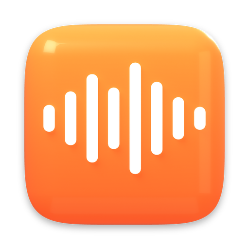
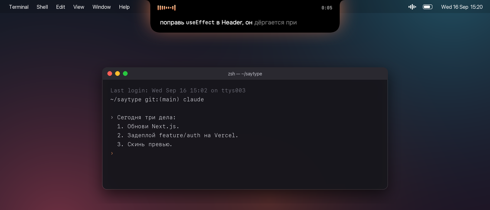
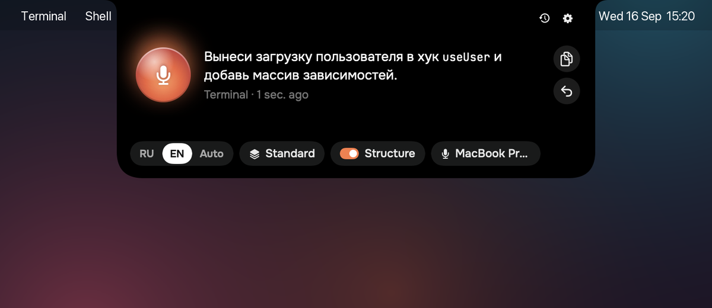
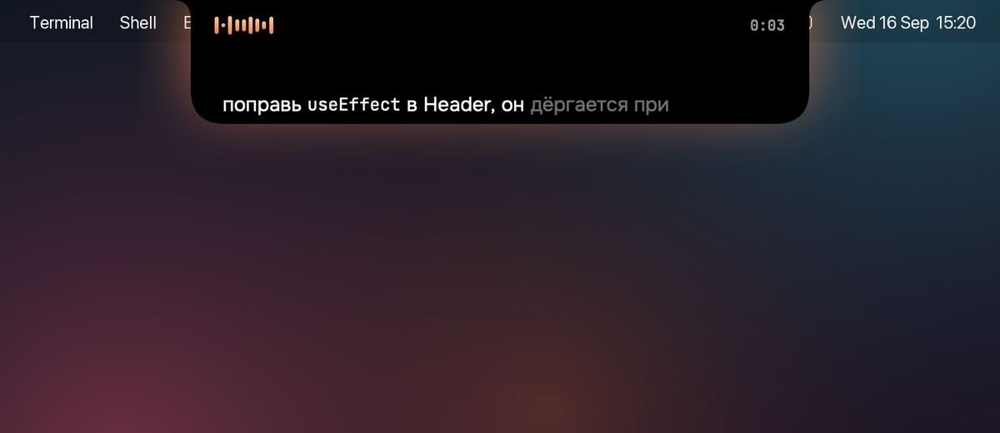
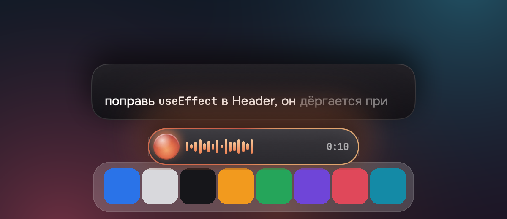
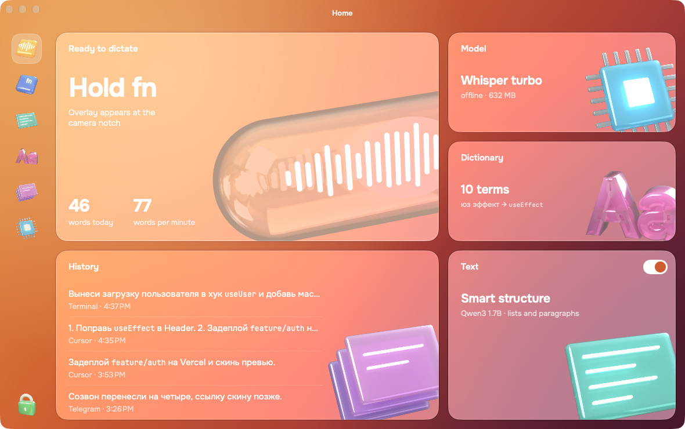

<p align="center">
  
</p>

<h1 align="center">saytype</h1>

<p align="center">
  Hold <kbd>fn</kbd>, talk, let go. Your words land in any app as clean, formatted text.<br>
  Whisper runs on your Mac. Nothing leaves it.
</p>

<p align="center">
  <a href="https://github.com/vladislavkovalskyi/saytype/releases/latest/download/saytype.dmg"></a>
</p>

<p align="center">
  macOS 26+ · Apple Silicon · Free and open source · <a href="README.ru.md">Читать по-русски</a>
</p>

<p align="center">
  
</p>

## Why saytype

- **You see the words while you speak.** Live text grows out of the notch as you talk, not after you stop.
- **Two languages in one sentence.** Say «поправь useEffect в Header» and get `useEffect` spelled like code, not transliterated.
- **Text arrives formatted.** Punctuation, paragraphs from pauses, numbered lists when you enumerate. A small local model adds structure to long dictations without touching your words.
- **Offline and private.** Recognition and formatting run on the Neural Engine and GPU. The network is used only to download models.

Built for people who talk to coding agents all day: Claude Code, Cursor, Codex, terminals, browsers, chat.

## Install

With Homebrew, the easiest way:

```sh
brew install --cask vladislavkovalskyi/tap/saytype
```

Or [download saytype.dmg](https://github.com/vladislavkovalskyi/saytype/releases/latest/download/saytype.dmg) and drag saytype to Applications.

Open it. Setup walks you through the record key, microphone and permissions, and downloads Whisper (632 MB).

> [!NOTE]
> saytype is free and isn't notarized by Apple, which costs $99 a year. After installing from the DMG, macOS may refuse the first launch: open **System Settings → Privacy & Security** and click **Open Anyway**, or run
> `xattr -dr com.apple.quarantine /Applications/saytype.app`. Homebrew does this for you.

## How it works

<table>
  <tr>
    <td width="50%"></td>
    <td width="50%"></td>
  </tr>
  <tr>
    <td><b>Hover the notch.</b> The island opens a panel: record, last dictation, language, structure, microphone.</td>
    <td><b>Hold fn and talk.</b> Confirmed words are bright, the tail is still settling.</td>
  </tr>
  <tr>
    <td></td>
    <td></td>
  </tr>
  <tr>
    <td><b>Prefer the bottom?</b> The pill sits above the Dock and glows with your voice.</td>
    <td><b>Settings, dictionary and history</b> live in one window.</td>
  </tr>
</table>

| | |
|---|---|
| <kbd>fn</kbd> hold | record, release to paste |
| <kbd>fn</kbd> double tap | hands-free, tap again to stop |
| <kbd>esc</kbd> | cancel |
| <kbd>⌃</kbd><kbd>⌥</kbd><kbd>V</kbd> | paste the last dictation again |
| <kbd>⌃</kbd><kbd>⌥</kbd><kbd>C</kbd> | copy the last dictation |

The record key can be <kbd>fn</kbd>, right <kbd>⌥</kbd> or right <kbd>⌘</kbd>.

## Models

| Model | Size | What it does |
|---|---|---|
| Whisper large-v3-turbo via [WhisperKit](https://github.com/argmaxinc/WhisperKit) | 632 MB | speech to text on the Neural Engine, live and final passes |
| Qwen3 1.7B 4-bit via [MLX](https://github.com/ml-explore/mlx-swift-lm) | 944 MB, optional | labels sentences as paragraphs or list items; the text is rebuilt from labels, so words never change |

Models live in `~/Library/Application Support/dev.kovalskyi.saytype/Models` and download from Hugging Face on first use.

On an M3 Pro a 5-second phrase is ready about 1.2 s after you let go. Smart structure adds ~0.6 s to long dictations and is skipped for short ones.

## Privacy

- Audio is processed in memory and never written to disk.
- Dictation history stays in a local JSON file; you can clear it or set how long it is kept.
- No accounts, analytics or telemetry. The only network requests download models and check for updates.

## Permissions

| Permission | Why |
|---|---|
| Microphone | to hear you while the record key is held |
| Input Monitoring | to notice the record key in any app |
| Accessibility | to paste into the focused field |

saytype pastes through the clipboard and restores what was there, skipping password fields.

## FAQ

**Text isn't pasted.** Check Accessibility for saytype in System Settings. After an update that changed the signature, remove saytype from the list and add it again.

**fn opens the emoji picker.** Set System Settings → Keyboard → "Press 🌐 key to" → "Do Nothing", or choose right ⌥ as the record key.

**The first launch takes minutes.** Core ML compiles Whisper for your chip once, about 2–3 minutes. Later launches take seconds.

**Reset everything.** `tccutil reset All dev.kovalskyi.saytype` and delete `~/Library/Application Support/dev.kovalskyi.saytype`.

## Build from source

Requirements: Xcode 26+, [XcodeGen](https://github.com/yonaskolb/XcodeGen), the Metal Toolchain component.

```sh
brew install xcodegen
xcodebuild -downloadComponent MetalToolchain
xcodegen generate
open saytype.xcodeproj
```

Core logic lives in the `Packages/SaytypeKit` Swift package with tests: `swift test --skip VMTranscriptionTests`. Design notes are in [`docs/dev`](docs/dev).

## Author

Made by Vladislav Kovalskyi.
[GitHub](https://github.com/vladislavkovalskyi) · [Telegram @yxuxo](https://t.me/yxuxo)

saytype stands on [WhisperKit](https://github.com/argmaxinc/WhisperKit), [mlx-swift-lm](https://github.com/ml-explore/mlx-swift-lm), [swift-transformers](https://github.com/huggingface/swift-transformers), [Sparkle](https://sparkle-project.org), OpenAI Whisper and Qwen3. Fonts: [Onest](https://github.com/simpals/onest) and [JetBrains Mono](https://www.jetbrains.com/lp/mono/), both under the OFL.

## License

[MIT](LICENSE)
