<p align="center">
  
</p>

<h1 align="center">saytype</h1>

<p align="center">
  Hold <kbd>fn</kbd>, talk, let go. Your words land in any app as clean, formatted text.<br>
  Whisper runs on your Mac. Nothing leaves it.
</p>

<p align="center">
  <a href="https://github.com/vladislavkovalskyi/saytype/releases/latest/download/saytype.dmg"></a>
</p>

<p align="center">
  macOS 26+ · Apple Silicon · Free and open source · <a href="README.ru.md">Читать по-русски</a>
</p>

<p align="center">
  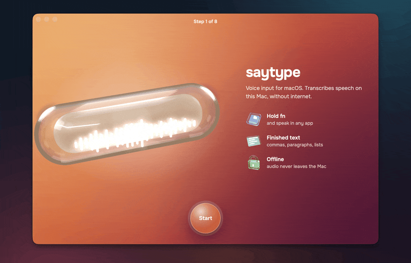
</p>

## Why saytype

- **You see the words while you speak.** Live text grows out of the notch as you talk, not after you stop.
- **Two languages in one sentence.** Say «поправь useEffect в Header» and get `useEffect` spelled like code, not transliterated.
- **Text arrives formatted.** Punctuation, paragraphs from pauses, numbered lists when you enumerate. A small local model adds structure to long dictations without touching your words.
- **Offline and private.** Recognition and formatting run on the Neural Engine and GPU. The network is used only to download models.

Built for people who talk to coding agents all day: Claude Code, Cursor, Codex, terminals, browsers, chat.

<p align="center">
  
</p>

## Install

With Homebrew, the easiest way:

```sh
brew install --cask vladislavkovalskyi/tap/saytype
```

Or [download saytype.dmg](https://github.com/vladislavkovalskyi/saytype/releases/latest/download/saytype.dmg) and drag saytype to Applications.

> [!NOTE]
> saytype is free and isn't notarized by Apple, which costs $99 a year. After installing from the DMG, macOS may refuse the first launch: open **System Settings → Privacy & Security** and click **Open Anyway**, or run
> `xattr -dr com.apple.quarantine /Applications/saytype.app`. Homebrew does this for you.

## First launch

Setup takes eight short steps. Whisper downloads once (632 MB), then Core ML prepares it for your chip, about 2–3 minutes.

<table>
  <tr>
    <td width="50%">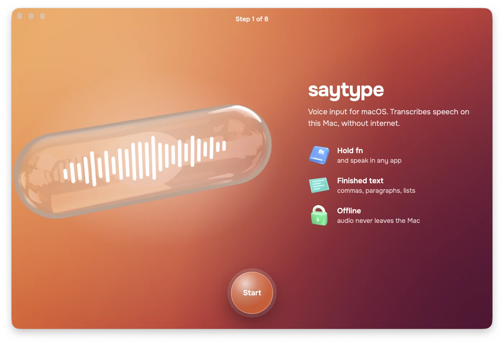</td>
    <td width="50%">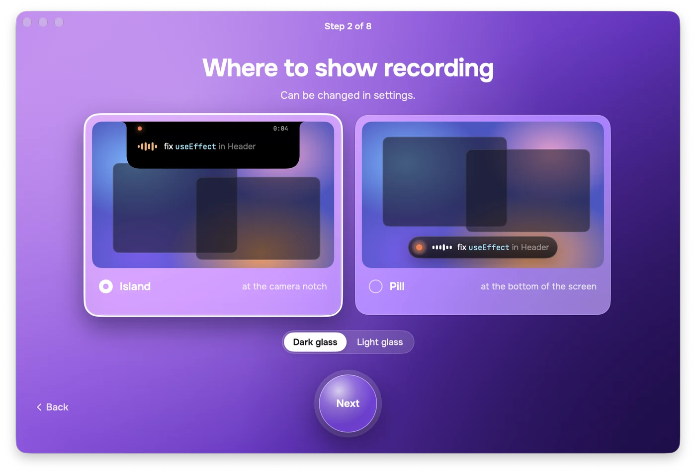</td>
  </tr>
  <tr>
    <td><b>1 · Welcome.</b> What saytype does, in three lines.</td>
    <td><b>2 · Overlay.</b> Island at the notch or pill above the Dock, dark or light glass.</td>
  </tr>
  <tr>
    <td>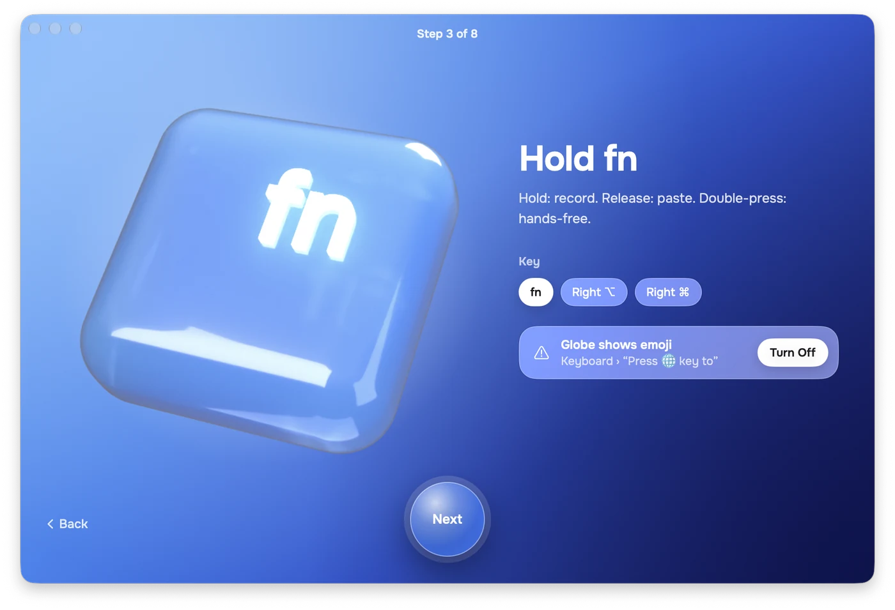</td>
    <td>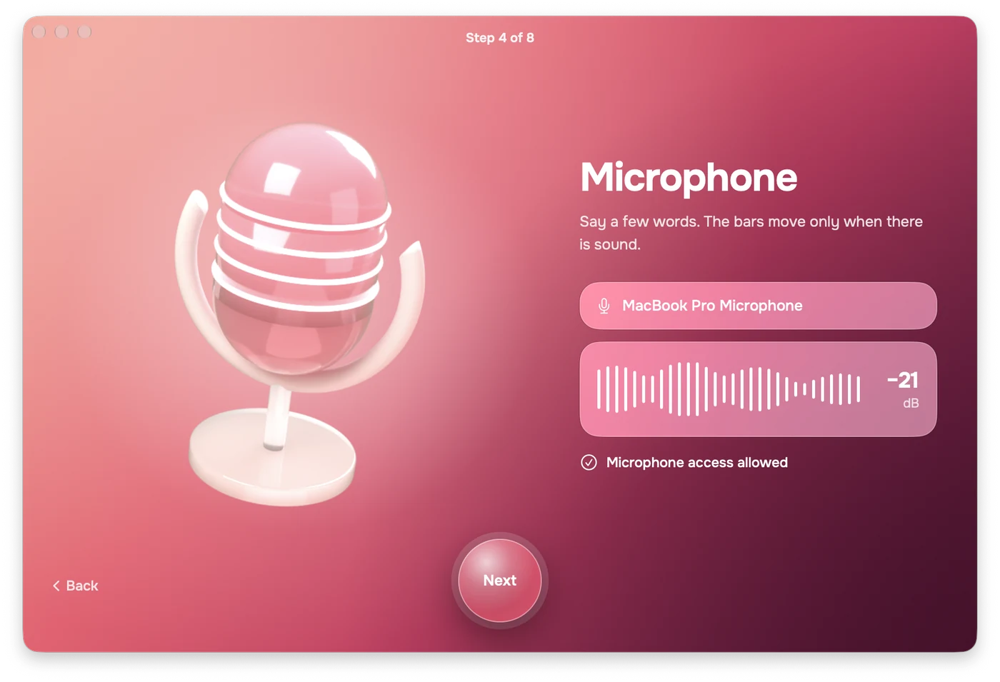</td>
  </tr>
  <tr>
    <td><b>3 · Record key.</b> fn, right ⌥ or right ⌘. Warns if 🌐 opens the emoji picker.</td>
    <td><b>4 · Microphone.</b> A live meter shows the Mac hears you.</td>
  </tr>
  <tr>
    <td>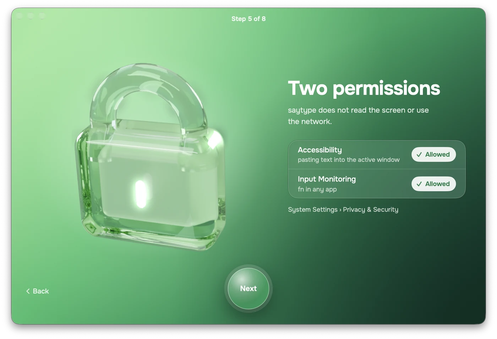</td>
    <td>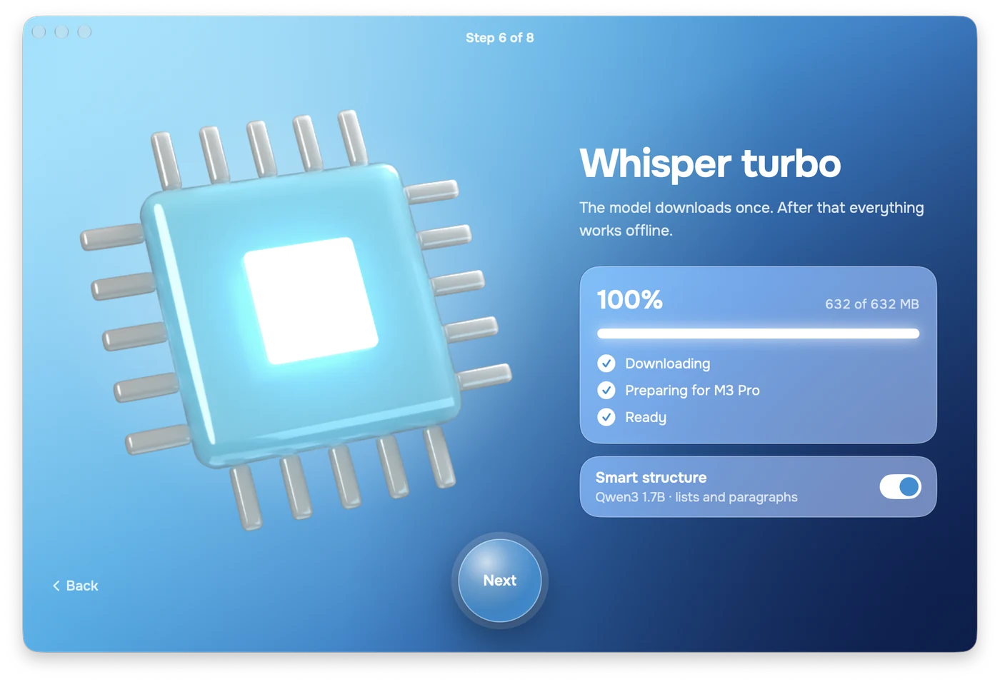</td>
  </tr>
  <tr>
    <td><b>5 · Permissions.</b> Accessibility and Input Monitoring, ticked as soon as you allow them.</td>
    <td><b>6 · Model.</b> Whisper download and preparation, plus optional smart structure.</td>
  </tr>
  <tr>
    <td>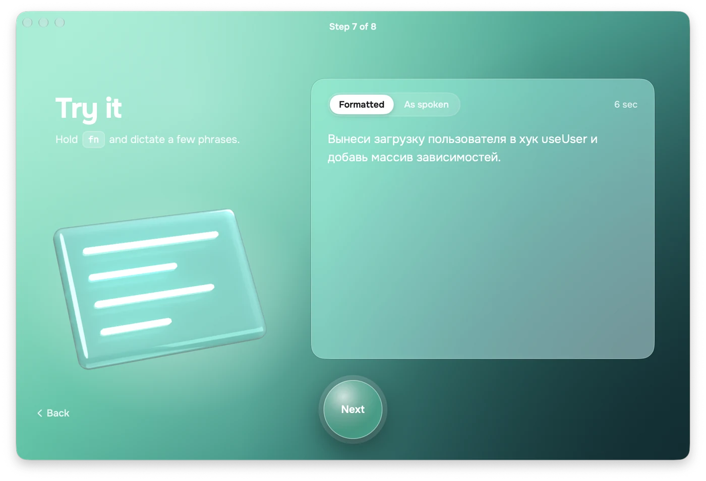</td>
    <td>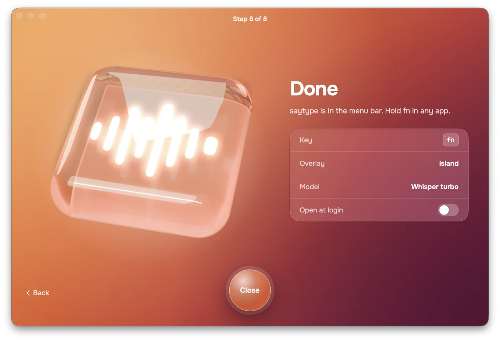</td>
  </tr>
  <tr>
    <td><b>7 · Try it.</b> Dictate into a test field and compare formatted text with what you said.</td>
    <td><b>8 · Done.</b> saytype moves to the menu bar. Turn on open at login.</td>
  </tr>
</table>

## How it works

<table>
  <tr>
    <td width="50%"></td>
    <td width="50%"></td>
  </tr>
  <tr>
    <td><b>Hover the notch.</b> The island opens a panel: record, last dictation, language, structure, microphone.</td>
    <td><b>Hold fn and talk.</b> Confirmed words are bright, the tail is still settling.</td>
  </tr>
  <tr>
    <td></td>
    <td>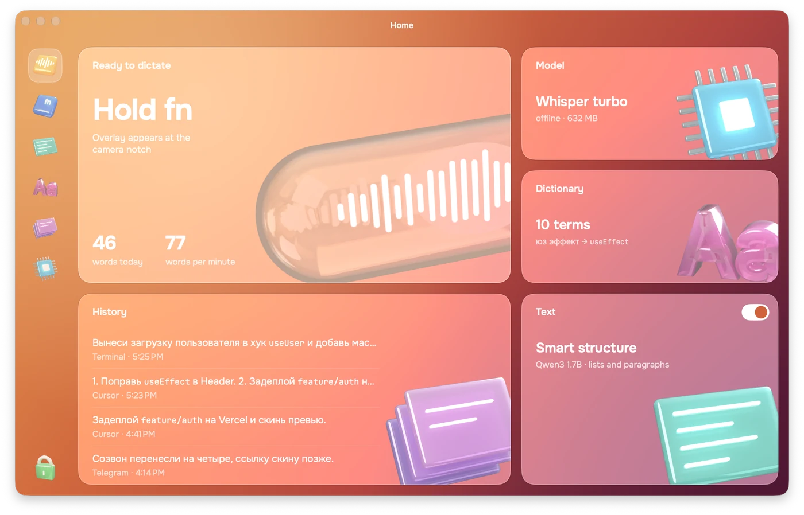</td>
  </tr>
  <tr>
    <td><b>Prefer the bottom?</b> The pill sits above the Dock and glows with your voice.</td>
    <td><b>Home.</b> Model state, today's words, pace and recent dictations.</td>
  </tr>
</table>

| Shortcut | Action |
|---|---|
| <kbd>fn</kbd> hold | record, release to paste |
| <kbd>fn</kbd> double press | hands-free, press again to stop |
| <kbd>esc</kbd> | cancel |
| <kbd>⌃</kbd><kbd>⌥</kbd><kbd>V</kbd> | paste the last dictation again |
| <kbd>⌃</kbd><kbd>⌥</kbd><kbd>C</kbd> | copy the last dictation |

## Settings

<table>
  <tr>
    <td width="50%">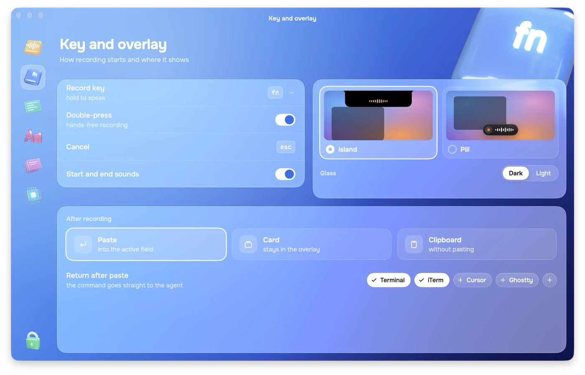</td>
    <td width="50%">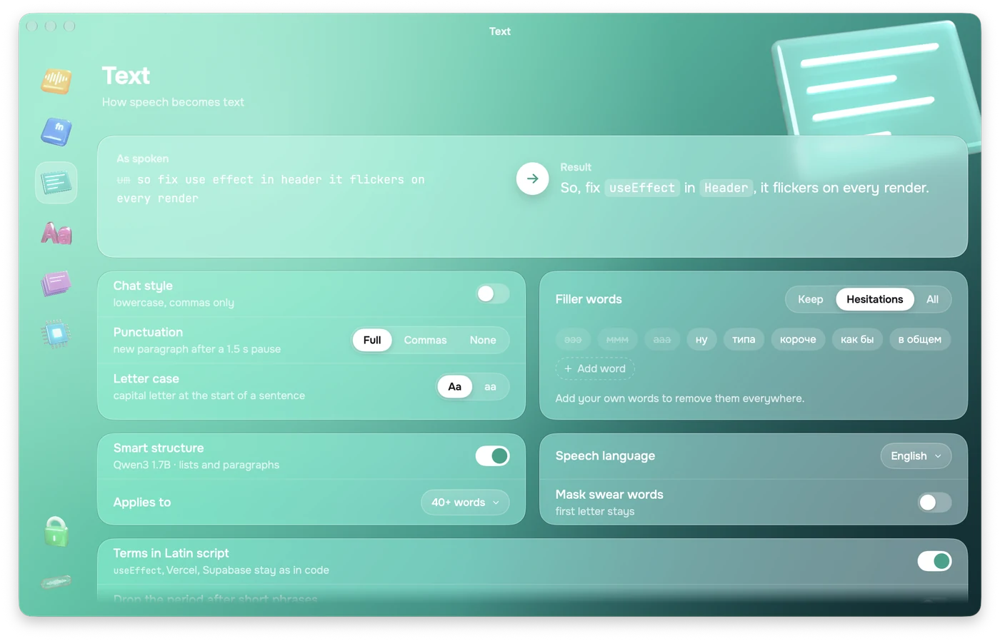</td>
  </tr>
  <tr>
    <td><b>Key and overlay.</b> Record key, sounds, island or pill, paste or card, Return after paste for terminals.</td>
    <td><b>Text.</b> Before and after, punctuation, smart structure, filler words, speech language.</td>
  </tr>
  <tr>
    <td>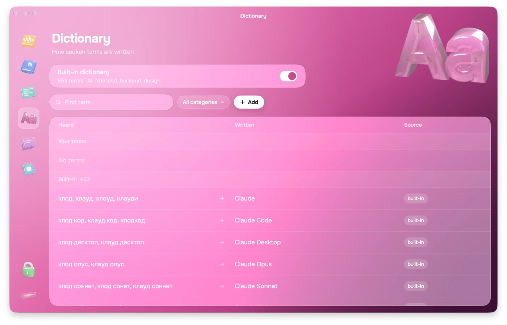</td>
    <td>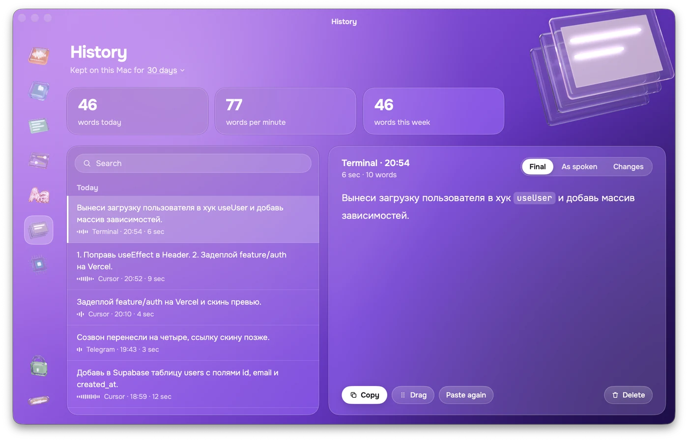</td>
  </tr>
  <tr>
    <td><b>Dictionary.</b> Teach it how you say a term and how it's spelled: «юз эффект» → <code>useEffect</code>.</td>
    <td><b>History.</b> Search, final text, what you said and the difference. Copy, drag or paste again.</td>
  </tr>
  <tr>
    <td>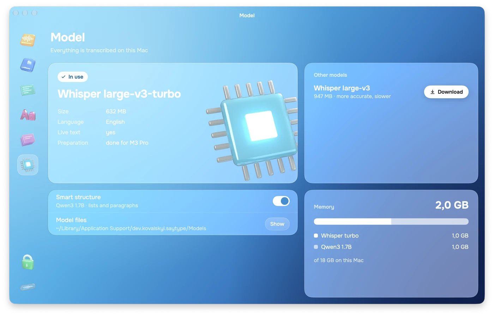</td>
    <td>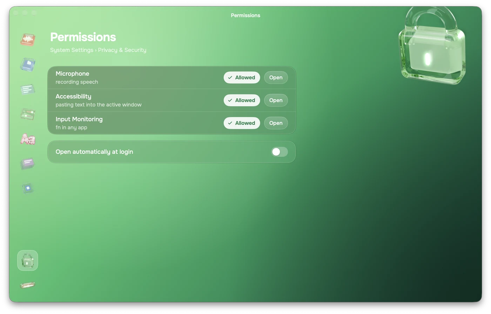</td>
  </tr>
  <tr>
    <td><b>Model.</b> Whisper turbo or large-v3, smart structure, memory use, model files.</td>
    <td><b>Permissions.</b> State of each permission with a shortcut to System Settings.</td>
  </tr>
</table>

## Models

| Model | Size | What it does |
|---|---|---|
| Whisper large-v3-turbo via [WhisperKit](https://github.com/argmaxinc/WhisperKit) | 632 MB | speech to text on the Neural Engine, live and final passes |
| Qwen3 1.7B 4-bit via [MLX](https://github.com/ml-explore/mlx-swift-lm) | 944 MB, optional | labels sentences as paragraphs or list items; the text is rebuilt from labels, so words never change |

Models live in `~/Library/Application Support/dev.kovalskyi.saytype/Models` and download from Hugging Face on first use.

On an M3 Pro a 5-second phrase is ready about 1.2 s after you let go. Smart structure adds ~0.6 s to long dictations and is skipped for short ones.

## Privacy

- Audio is processed in memory and never written to disk.
- Dictation history stays in a local JSON file; you can clear it or set how long it is kept.
- No accounts, analytics or telemetry. The only network requests download models and check for updates.

## Permissions

| Permission | Why |
|---|---|
| Microphone | to hear you while the record key is held |
| Input Monitoring | to notice the record key in any app |
| Accessibility | to paste into the focused field |

saytype pastes through the clipboard and restores what was there, skipping password fields.

## Reset everything

**Run setup again.** Click the saytype icon in the menu bar → **Run Setup Again…** Your history, dictionary and models stay.

**Reset permissions**, for example when paste stops working after an update:

```sh
tccutil reset Accessibility dev.kovalskyi.saytype
tccutil reset ListenEvent dev.kovalskyi.saytype   # Input Monitoring
tccutil reset Microphone dev.kovalskyi.saytype
```

Then open saytype and allow them again.

**Start from scratch.** Quit saytype from the menu bar, then:

```sh
tccutil reset All dev.kovalskyi.saytype                           # permissions
defaults delete dev.kovalskyi.saytype                             # settings and dictionary
rm -rf ~/Library/Application\ Support/dev.kovalskyi.saytype       # history and models, up to 1.6 GB
rm -rf ~/Library/Caches/dev.kovalskyi.saytype
```

The next launch starts setup from step 1 and downloads Whisper again. To keep the models, skip the `rm -rf …Application Support…` line and delete only `history.json` inside it.

**Uninstall.**

```sh
brew uninstall --zap --cask saytype
```

Without Homebrew: quit saytype, move it from Applications to the Trash and run the commands from “Start from scratch”. If you turned on open at login, remove saytype in System Settings → General → Login Items.

## FAQ

**Text isn't pasted.** Check Accessibility for saytype in System Settings. If it is on but paste still fails, reset permissions as described above.

**fn opens the emoji picker.** Set System Settings → Keyboard → “Press 🌐 key to” → “Do Nothing”, or choose right ⌥ as the record key.

**The first launch takes minutes.** Core ML compiles Whisper for your chip once, about 2–3 minutes. Later launches take seconds.

**The island doesn't open on hover.** The hover panel needs a MacBook screen with a notch. On other displays the island appears while you dictate, and the menu bar icon has most of the same controls.

## Build from source

Requirements: Xcode 26+, [XcodeGen](https://github.com/yonaskolb/XcodeGen), the Metal Toolchain component.

```sh
brew install xcodegen
xcodebuild -downloadComponent MetalToolchain
xcodegen generate
open saytype.xcodeproj
```

Core logic lives in the `Packages/SaytypeKit` Swift package with tests: `swift test --skip VMTranscriptionTests`. Releases: [`docs/RELEASING.md`](docs/RELEASING.md). Design notes: [`docs/dev`](docs/dev).

## Author

Made by Vladislav Kovalskyi.
[GitHub](https://github.com/vladislavkovalskyi) · [Telegram @yxuxo](https://t.me/yxuxo)

saytype stands on [WhisperKit](https://github.com/argmaxinc/WhisperKit), [mlx-swift-lm](https://github.com/ml-explore/mlx-swift-lm), [swift-transformers](https://github.com/huggingface/swift-transformers), [Sparkle](https://sparkle-project.org), OpenAI Whisper and Qwen3. Fonts: [Onest](https://github.com/simpals/onest) and [JetBrains Mono](https://www.jetbrains.com/lp/mono/), both under the OFL.

## License

[MIT](LICENSE)
