<p align="center">
  
</p>

<h1 align="center">saytype</h1>

<p align="center">
  Зажми <kbd>fn</kbd>, скажи, отпусти. Текст с запятыми, абзацами и списками появится в любом приложении.<br>
  Whisper работает на твоём Mac, звук никуда не уходит.
</p>

<p align="center">
  <a href="https://github.com/vladislavkovalskyi/saytype/releases/latest/download/saytype.dmg"></a>
</p>

<p align="center">
  macOS 26+ · Apple Silicon · Бесплатно, открытый код · <a href="README.md">English</a>
</p>

<p align="center">
  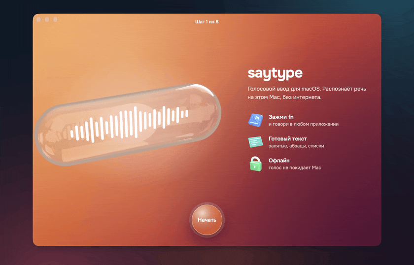
</p>

## Зачем

- **Текст виден, пока говоришь.** Слова появляются в острове у выреза прямо во время речи.
- **Русский и английский в одной фразе.** Скажи «поправь useEffect в Header» и получишь `useEffect` так, как он пишется в коде, а не «юз эффект».
- **Текст сразу оформлен.** Знаки препинания, абзацы по паузам, нумерованный список, когда перечисляешь. Маленькая локальная модель расставляет структуру в длинных диктовках и не меняет слова.
- **Офлайн.** Распознавание и оформление идут на Neural Engine и GPU. Сеть нужна только для загрузки моделей.

Сделано для тех, кто весь день говорит с агентами: Claude Code, Cursor, Codex, терминал, браузер, мессенджеры.

<p align="center">
  
</p>

## Установка

Проще всего через Homebrew:

```sh
brew install --cask vladislavkovalskyi/tap/saytype
```

Или [скачай saytype.dmg](https://github.com/vladislavkovalskyi/saytype/releases/latest/download/saytype.dmg) и перетащи saytype в «Программы».

> [!NOTE]
> saytype бесплатный и не нотаризован Apple: нотаризация стоит $99 в год. После установки из DMG macOS может не открыть приложение с первого раза: открой **Системные настройки → Конфиденциальность и безопасность** и нажми **Всё равно открыть**, или выполни
> `xattr -dr com.apple.quarantine /Applications/saytype.app`. Homebrew делает это сам.

## Первый запуск

Настройка — восемь коротких шагов. Whisper скачивается один раз (632 МБ), потом Core ML готовит его под твой чип, это 2–3 минуты.

<table>
  <tr>
    <td width="50%">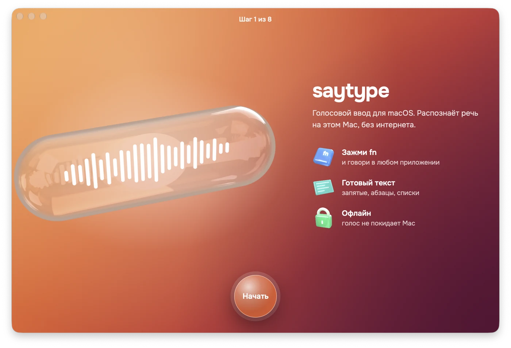</td>
    <td width="50%">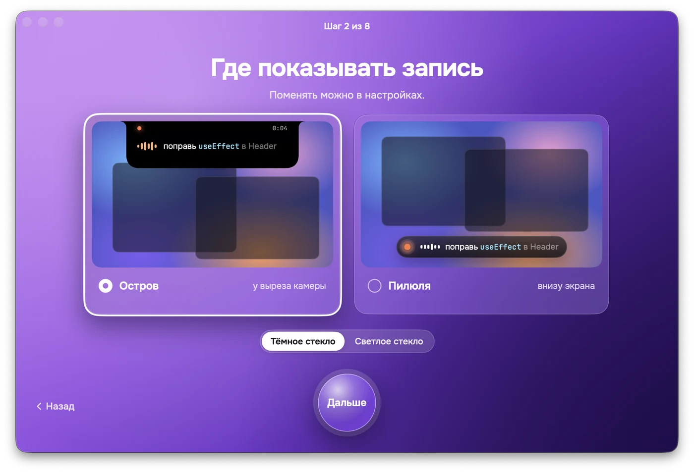</td>
  </tr>
  <tr>
    <td><b>1 · Приветствие.</b> Что умеет saytype, в трёх строках.</td>
    <td><b>2 · Плашка.</b> Остров у выреза или пилюля над Dock, тёмное или светлое стекло.</td>
  </tr>
  <tr>
    <td>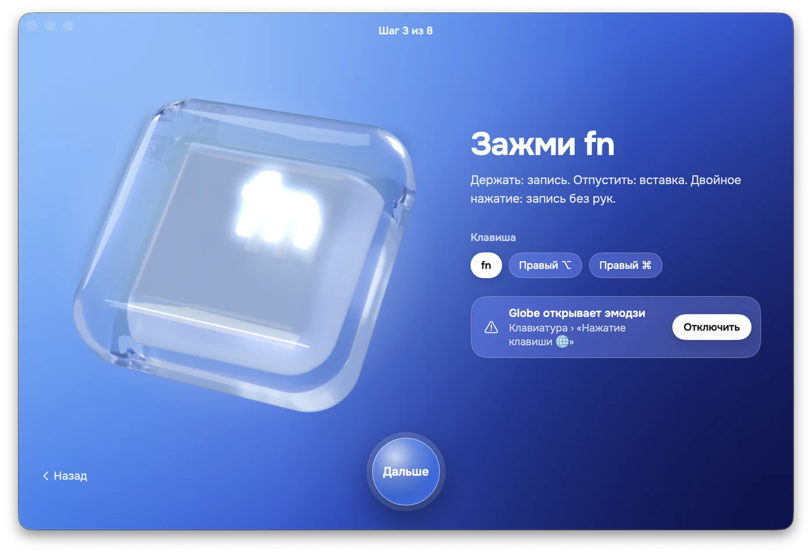</td>
    <td>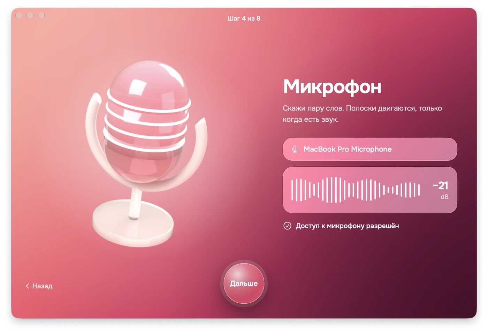</td>
  </tr>
  <tr>
    <td><b>3 · Клавиша.</b> fn, правый ⌥ или правый ⌘. Подскажет, если 🌐 открывает эмодзи.</td>
    <td><b>4 · Микрофон.</b> Живой индикатор показывает, что Mac тебя слышит.</td>
  </tr>
  <tr>
    <td>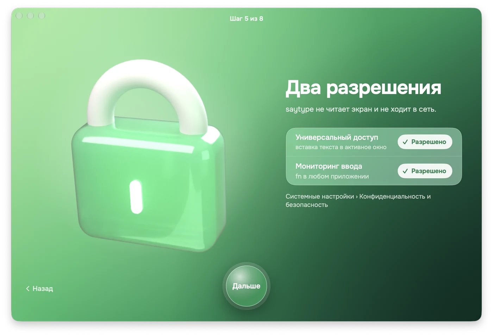</td>
    <td>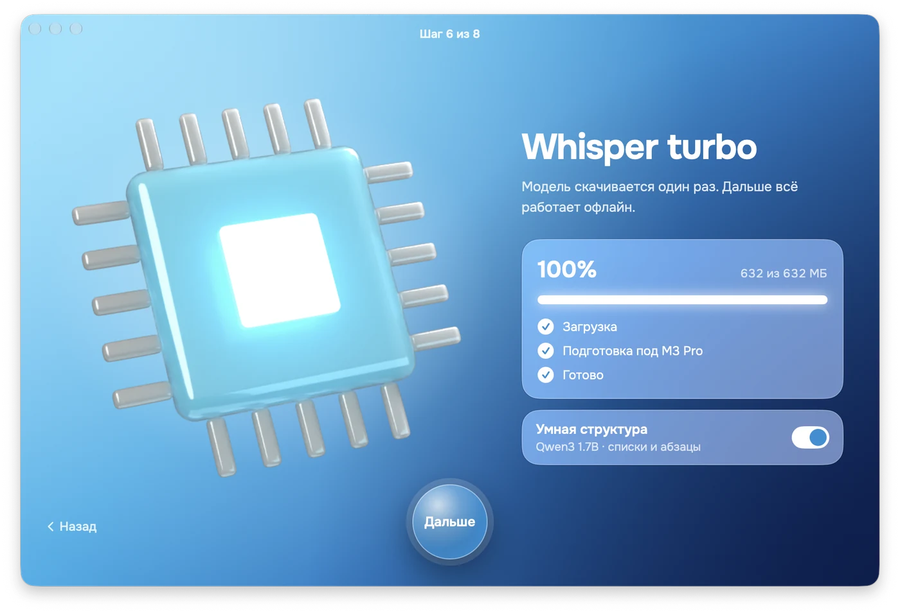</td>
  </tr>
  <tr>
    <td><b>5 · Разрешения.</b> Универсальный доступ и мониторинг ввода, галочки ставятся сами, как только разрешишь.</td>
    <td><b>6 · Модель.</b> Загрузка и подготовка Whisper, по желанию умная структура.</td>
  </tr>
  <tr>
    <td>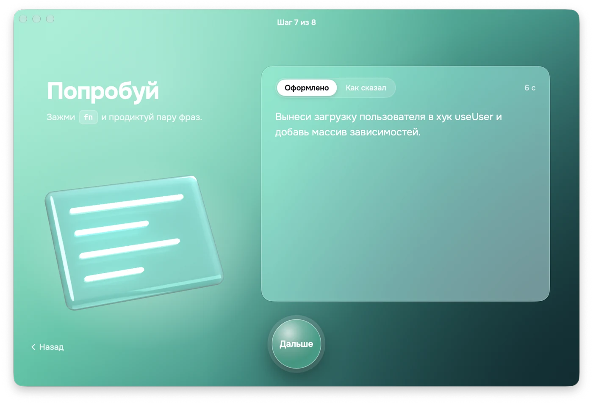</td>
    <td>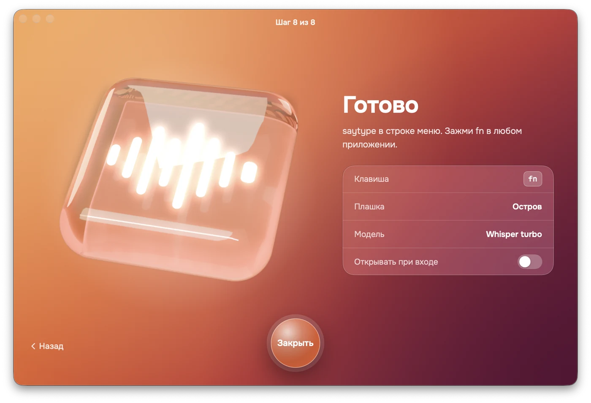</td>
  </tr>
  <tr>
    <td><b>7 · Попробуй.</b> Надиктуй в тестовое поле и сравни оформленный текст с тем, что сказал.</td>
    <td><b>8 · Готово.</b> saytype уходит в строку меню. Можно включить запуск при входе.</td>
  </tr>
</table>

## Как пользоваться

<table>
  <tr>
    <td width="50%"></td>
    <td width="50%"></td>
  </tr>
  <tr>
    <td><b>Наведи курсор на вырез.</b> Откроется панель: запись, последняя диктовка, язык, структура, микрофон.</td>
    <td><b>Зажми fn и говори.</b> Подтверждённые слова яркие, хвост ещё уточняется.</td>
  </tr>
  <tr>
    <td></td>
    <td>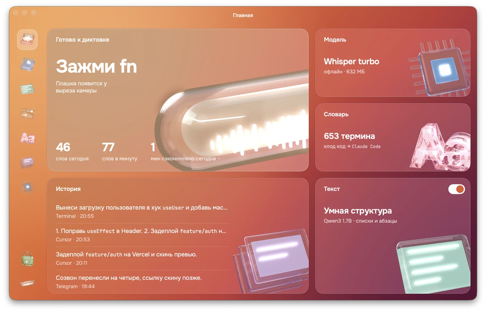</td>
  </tr>
  <tr>
    <td><b>Удобнее внизу?</b> Пилюля висит над Dock и светится в такт голосу.</td>
    <td><b>Главная.</b> Состояние модели, слова за сегодня, темп и последние диктовки.</td>
  </tr>
</table>

| Клавиши | Что делают |
|---|---|
| держать <kbd>fn</kbd> | запись, отпустил — вставка |
| дважды <kbd>fn</kbd> | запись без рук, ещё раз — стоп |
| <kbd>esc</kbd> | отмена |
| <kbd>⌃</kbd><kbd>⌥</kbd><kbd>V</kbd> | вставить последнюю диктовку ещё раз |
| <kbd>⌃</kbd><kbd>⌥</kbd><kbd>C</kbd> | скопировать последнюю диктовку |

## Настройки

<table>
  <tr>
    <td width="50%">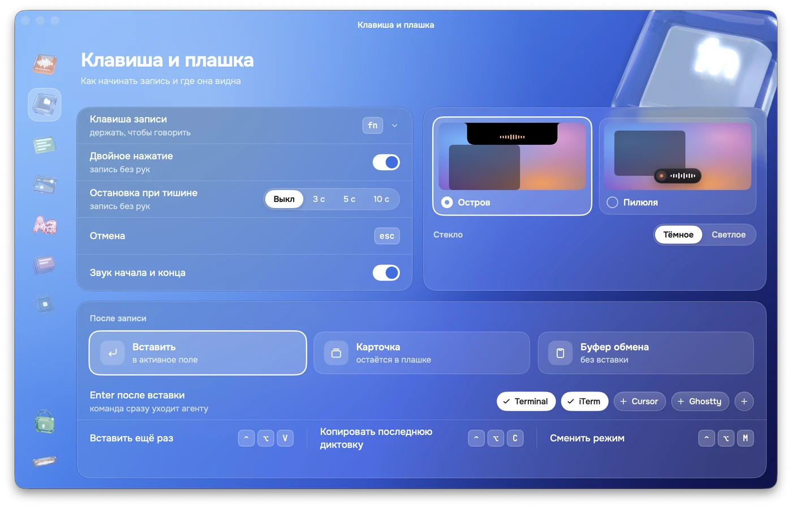</td>
    <td width="50%">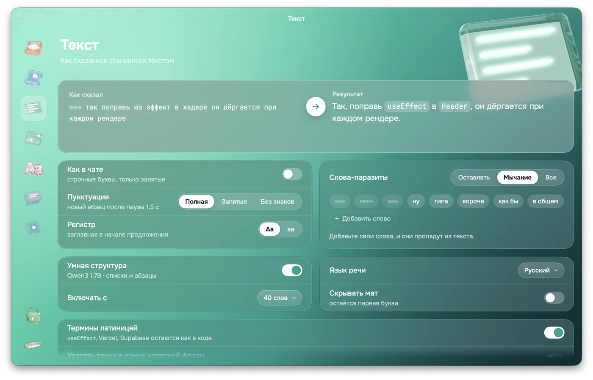</td>
  </tr>
  <tr>
    <td><b>Клавиша и плашка.</b> Клавиша записи, звуки, остров или пилюля, вставка или карточка, Enter после вставки для терминалов.</td>
    <td><b>Текст.</b> До и после, пунктуация, умная структура, слова-паразиты, язык речи.</td>
  </tr>
  <tr>
    <td>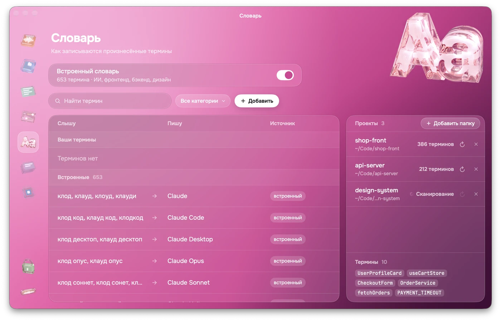</td>
    <td>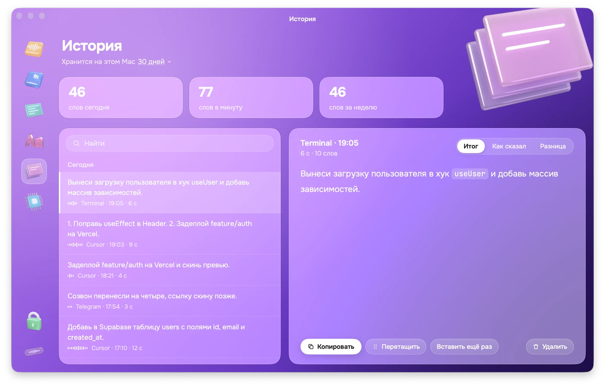</td>
  </tr>
  <tr>
    <td><b>Словарь.</b> Как ты произносишь термин и как он пишется: «юз эффект» → <code>useEffect</code>.</td>
    <td><b>История.</b> Поиск, итоговый текст, как сказал и разница. Скопировать, перетащить или вставить ещё раз.</td>
  </tr>
  <tr>
    <td>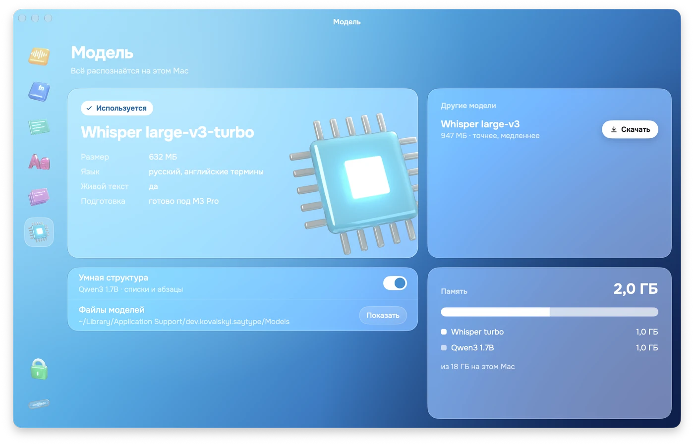</td>
    <td>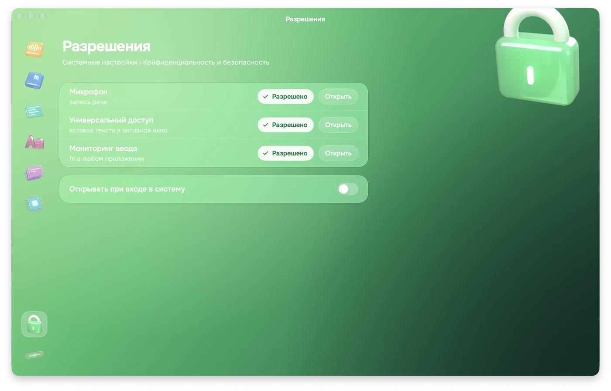</td>
  </tr>
  <tr>
    <td><b>Модель.</b> Whisper turbo или large-v3, умная структура, память, файлы моделей.</td>
    <td><b>Разрешения.</b> Статус каждого разрешения и переход в Системные настройки.</td>
  </tr>
</table>

## Модели

| Модель | Размер | Что делает |
|---|---|---|
| Whisper large-v3-turbo через [WhisperKit](https://github.com/argmaxinc/WhisperKit) | 632 МБ | речь в текст на Neural Engine, живой и финальный проход |
| Qwen3 1.7B 4-bit через [MLX](https://github.com/ml-explore/mlx-swift-lm) | 944 МБ, по желанию | размечает предложения как абзацы или пункты списка; текст собирается из меток, слова не меняются |

Модели лежат в `~/Library/Application Support/dev.kovalskyi.saytype/Models` и скачиваются с Hugging Face при первом запуске.

На M3 Pro фраза в 5 секунд готова примерно через 1,2 с после отпускания клавиши. Умная структура добавляет ~0,6 с к длинным диктовкам и пропускается для коротких.

## Приватность

- Звук обрабатывается в памяти и не пишется на диск.
- История диктовок — локальный JSON-файл, её можно очистить или ограничить срок хранения.
- Ни аккаунтов, ни аналитики. Сеть нужна только для загрузки моделей и проверки обновлений.

## Разрешения

| Разрешение | Зачем |
|---|---|
| Микрофон | слушать, пока зажата клавиша записи |
| Мониторинг ввода | замечать клавишу записи в любом приложении |
| Универсальный доступ | вставлять текст в активное поле |

saytype вставляет через буфер обмена и возвращает прежнее содержимое. В поля паролей не вставляет.

## Как всё сбросить

**Пройти настройку заново.** Нажми иконку saytype в строке меню → **Пройти настройку заново…** История, словарь и модели останутся.

**Сбросить разрешения**, например если после обновления перестала работать вставка:

```sh
tccutil reset Accessibility dev.kovalskyi.saytype
tccutil reset ListenEvent dev.kovalskyi.saytype   # мониторинг ввода
tccutil reset Microphone dev.kovalskyi.saytype
```

Потом открой saytype и выдай разрешения снова.

**Начать с нуля.** Закрой saytype через строку меню и выполни:

```sh
tccutil reset All dev.kovalskyi.saytype                           # разрешения
defaults delete dev.kovalskyi.saytype                             # настройки и словарь
rm -rf ~/Library/Application\ Support/dev.kovalskyi.saytype       # история и модели, до 1,6 ГБ
rm -rf ~/Library/Caches/dev.kovalskyi.saytype
```

Следующий запуск начнёт настройку с первого шага и скачает Whisper заново. Чтобы оставить модели, пропусти строку `rm -rf …Application Support…` и удали внутри только `history.json`.

**Удалить saytype.**

```sh
brew uninstall --zap --cask saytype
```

Без Homebrew: закрой saytype, перенеси его из «Программ» в Корзину и выполни команды из «Начать с нуля». Если включал запуск при входе, убери saytype в Системные настройки → Основные → Объекты входа.

## Вопросы

**Текст не вставляется.** Проверь saytype в «Универсальном доступе». Если включено, а вставка не работает, сбрось разрешения, как описано выше.

**fn открывает эмодзи.** Системные настройки → Клавиатура → «Нажатие клавиши 🌐» → «Ничего не делать», или выбери правый ⌥ клавишей записи.

**Первый запуск долгий.** Core ML один раз готовит Whisper под твой чип, это 2–3 минуты. Дальше запуск занимает секунды.

**Остров не открывается при наведении.** Панели при наведении нужен экран MacBook с вырезом. На других мониторах остров появляется во время диктовки, а большая часть тех же настроек есть в меню в строке меню.

## Сборка из исходников

Нужны Xcode 26+, [XcodeGen](https://github.com/yonaskolb/XcodeGen) и компонент Metal Toolchain.

```sh
brew install xcodegen
xcodebuild -downloadComponent MetalToolchain
xcodegen generate
open saytype.xcodeproj
```

Логика — в Swift-пакете `Packages/SaytypeKit`, тесты: `swift test --skip VMTranscriptionTests`. Релизы: [`docs/RELEASING.md`](docs/RELEASING.md). Техдизайн: [`docs/dev`](docs/dev).

## Автор

Vladislav Kovalskyi.
[GitHub](https://github.com/vladislavkovalskyi) · [Telegram @yxuxo](https://t.me/yxuxo)

Внутри [WhisperKit](https://github.com/argmaxinc/WhisperKit), [mlx-swift-lm](https://github.com/ml-explore/mlx-swift-lm), [swift-transformers](https://github.com/huggingface/swift-transformers), [Sparkle](https://sparkle-project.org), OpenAI Whisper и Qwen3. Шрифты [Onest](https://github.com/simpals/onest) и [JetBrains Mono](https://www.jetbrains.com/lp/mono/) под лицензией OFL.

## Лицензия

[MIT](LICENSE)
